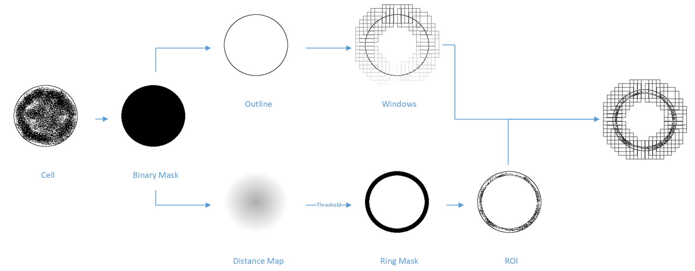

# Cell contour tracing and space decomposition

This repository allows to extract overlapping windows along a cell contour with 2D/3D binary masks.
It is my first project for which I started to learn python and GUI programming.
A summary of a potential workflow is shown below.

It is meant to automatically extract patches along the contour of a cell (electron micrograph or tomogram).
These patches are then fed to an image segmentation algorithm (e.g. random forest with ilastik or deep learning methods).
The goal is to automatically segment the subpelicular microtubules that run under the cell membrane of a cell body.
The predictions are put together and the result in combination with a region of interest (ROI) map (generated from a binary mask) allows to eliminate false predictions and only keep the information that is close to the cell membrane. 

### An example:

<table>
  <tr>
    <td>Image</td>
    <td>Mask</td>
  </tr>
  <tr>
    <td></td>
    <td></td>
  </tr>
  <tr>
    <td>Outline</td>
    <td>Windows</td>
  </tr>
  <tr>
    <td></td>
    <td></td>
  </tr>
</table>

### Test run (GUI)

To test the function, run the app (based on tkinter) with

    python .../App_contour_tracing.py

